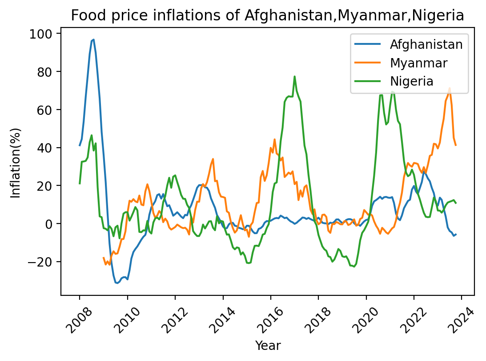
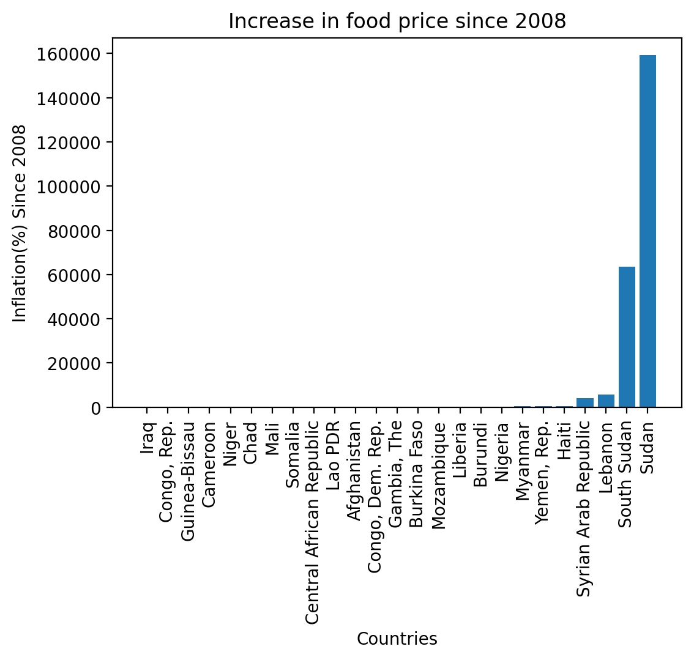
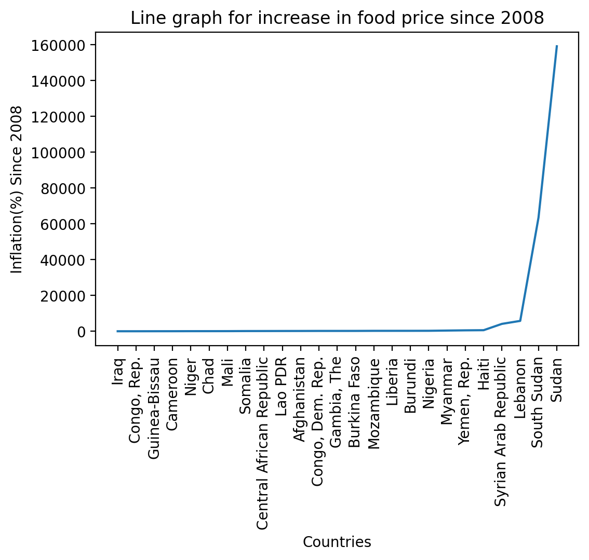

# ADS1_assignement1

ADS1 Assignment-1
 Report

Name: Jerome Paulraj
Student ID: 22074395

Links to Data Sets used:
1)	https://www.kaggle.com/datasets/anshtanwar/monthly-food-price-estimates
-	This dataset gives us details of monthly food price inflation for countries. It consists of two files, one with inflation details for every month and the second file containsfiner details of the dataset. Describing what types of food were observed including the total increase in inflation since start of observations. Observations began since 2008. But inflation data is available only from 2009. 

2)	https://www.kaggle.com/datasets/iamsouravbanerjee/customer-shopping-trends-dataset
-	This dataset encompasses various features related to customer shopping preferences, which is essential information for businesses seeking to make purchasing from them more attractive. The features include customer age, gender, purchase amount, preferred payment methods, frequency of purchases, and feedback ratings. The file “shooping_trends_updated.csv” is used in this assignement.

Link to code:
-	GitHub Link: jerome-p/ADS1_assignement1 - GitHub

Visualisation 1:
Comparison of food price Inflation between Afghanistan, Myanmar, Nigeria

 

From the above graph we can say that the food inflation of Afghanistan is somewhat more stable past 2011, when compared to the other two countries. It can also be observed that Afghanistan witnessed a severe drop in inflation between 2008 and 2010. 
Nigeria on the other hand seems to be more extreme with its change of inflation. With it peaking multiple times around 2015 and 2021. 
Myanmar looks the most “stable”, with less drastic changes. There are several peaks for Myanmar as well, but not as high as Nigeria. But towards the end the food inflation prices seem to be increasing for Myanmar rapidly
Both Nigeria and Afghanistan have lesser food inflation from when the observation was started, ie both of them seem to be reducing their food prices. Which is in contrast to Myanmar, who started off with lesser inflation than both the countries, but now has a higher inflation. 

This finding can be justified by the next visualisation.

Visualisation 2:
Increase in Food Price inflation since start of observation (2008)

 

The Bar plot is used to visualise the increase in inflation of food prices, when compared to the beginning of observations. Before plotting, the data needs to be sorted in increasing order based on the inflation value. This is done to make the plot more readable and also gives us an idea of which country has more inflation since 2008.
Upon plotting the sorted data, the plot seems to be skewed by the last 4 countries. i.e the values of the last 4 countries are so high that the rest of the country’s inflation data does not show up on the graph. In-order to be able to visualise other country’s inflation data. We will have to remove the countries with largest amounts of inflation from our dataset, i.e the last 4 countries.
 

Using this line graph as reference, we can see that the data rises rapidly after Haiti. Hence, lets keep Haiti as our last country, and visualise the data once again. i.e we are removing Syrian Arab Republic, Lebanon, South Sudan and Sudan from our dataset. 

.png)
 

Upon, creating another bar plot with the modified data, the finding from the first visualisation (line graph) is confirmed in this bar graph. We can see that Nigeria has a higher increase in inflation since the start of observations, when compared to Myanmar and Afghanistan.
All the values represented in the bar graph are percentiles. This graph gives us information on how much the inflation has increased for each country since the start of observations (2008).

Visualisation 3: 
Payment methods used by customers for purchases

 

This pie chart gives a visual representation of the payment methods used by customers. The values inside the chart gives the percentage of total transactions done using the particular payment method. Since this dataset is made of synthetic data, the pie-chart will not reflect real world shopping trends, but tries to emulate it. 
We can say that people prefer to use credit cards more than debit cards, although not by a big margin. And in online payments, PayPal beats Venmo by about 1.2%. Even with all the added convenience of online and cashless payments, cash seems to be favoured almost equally to a credit card. 
